**目录**

[1、使用easypoi依赖和hutool包](#1%E3%80%81%E4%BD%BF%E7%94%A8easypoi%E4%BE%9D%E8%B5%96%E5%92%8Chutool%E5%8C%85)

[2、创建word模板](#2%E3%80%81%E5%88%9B%E5%BB%BAword%E6%A8%A1%E6%9D%BF)

[3、代码](#3%E3%80%81%E4%BB%A3%E7%A0%81)

[3.1后端代码](#3.1%E5%90%8E%E7%AB%AF%E4%BB%A3%E7%A0%81)

[3.2与前端交互](#3.2%E4%B8%8E%E5%89%8D%E7%AB%AF%E4%BA%A4%E4%BA%92)

[3.2.1后端返回数据类型](#3.2.1%E5%90%8E%E7%AB%AF%E8%BF%94%E5%9B%9E%E6%95%B0%E6%8D%AE%E7%B1%BB%E5%9E%8B)

[3.2.2前端代码](#3.2.2%E5%89%8D%E7%AB%AF%E4%BB%A3%E7%A0%81)

[3.3图片导出](#3.3%E5%9B%BE%E7%89%87%E5%AF%BC%E5%87%BA)

[4、模板导出的坑（建议仔细浏览）](#%C2%A04%E3%80%81%E6%A8%A1%E6%9D%BF%E5%AF%BC%E5%87%BA%E7%9A%84%E5%9D%91%EF%BC%88%E5%BB%BA%E8%AE%AE%E4%BB%94%E7%BB%86%E6%B5%8F%E8%A7%88%EF%BC%89)

[4.1创建文件必须使用docx（2007的文档）](#4.1%E5%88%9B%E5%BB%BA%E6%96%87%E4%BB%B6%E5%BF%85%E9%A1%BB%E4%BD%BF%E7%94%A8docx%EF%BC%882007%E7%9A%84%E6%96%87%E6%A1%A3%EF%BC%89)

[4.2被填充的值，导出之后依旧显示{{value}}](#4.2%E8%A2%AB%E5%A1%AB%E5%85%85%E7%9A%84%E5%80%BC%EF%BC%8C%E5%AF%BC%E5%87%BA%E4%B9%8B%E5%90%8E%E4%BE%9D%E6%97%A7%E6%98%BE%E7%A4%BA%7B%7Bvalue%7D%7D)

[4.3请求得到的数据是null，直接填充给模板可能会报空指针异常](#4.3%E8%AF%B7%E6%B1%82%E5%BE%97%E5%88%B0%E7%9A%84%E6%95%B0%E6%8D%AE%E6%98%AFnull%EF%BC%8C%E7%9B%B4%E6%8E%A5%E5%A1%AB%E5%85%85%E7%BB%99%E6%A8%A1%E6%9D%BF%E5%8F%AF%E8%83%BD%E4%BC%9A%E6%8A%A5%E7%A9%BA%E6%8C%87%E9%92%88%E5%BC%82%E5%B8%B8)

[4.4使用  \\$fe:  遍历元素时的坑：](#4.4%E4%BD%BF%E7%94%A8%20%C2%A0%24fe%3A%20%C2%A0%E9%81%8D%E5%8E%86%E5%85%83%E7%B4%A0%E6%97%B6%E7%9A%84%E5%9D%91%EF%BC%9A)

[5、线上部署](#5%E3%80%81%E7%BA%BF%E4%B8%8A%E9%83%A8%E7%BD%B2%C2%A0)

[5.1将word模板放在静态资源中](#5.1%E5%B0%86word%E6%A8%A1%E6%9D%BF%E6%94%BE%E5%9C%A8%E9%9D%99%E6%80%81%E8%B5%84%E6%BA%90%E4%B8%AD)

[5.2导出的word文档乱码](#5.2%E5%AF%BC%E5%87%BA%E7%9A%84word%E6%96%87%E6%A1%A3%E4%B9%B1%E7%A0%81%C2%A0)

### java基于POI实现向word模板填充数据

在做项目的时候遇到需要将个人信息转换为word简历文档,就想到了这个方法。

这里创建word模板时，必须**使用docx结尾**的word文档。

注意：XWPFDocument不支持doc类型文档，做模板的时候要另存为[docx](https://so.csdn.net/so/search?q=docx&spm=1001.2101.3001.7020)。

**这里给的都是完整代码，可直接食用**

***使用easypoi和hutool包来导出Word文档的方法。***

***需要注意一些坑：***

***如文件格式、填充值时要注意是否为英文符号、使用"\$fe"遍历元素的问题等。***

***另外，还介绍了如何导出图片和将导出的Word文档响应给前端。***

## ******1、使用easypoi依赖和hutool包******

```java
<dependency>
    <groupId>cn.afterturn</groupId>
    <artifactId>easypoi-base</artifactId>
    <version>4.3.0</version>
</dependency>
<dependency>
    <groupId>cn.afterturn</groupId>
    <artifactId>easypoi-web</artifactId>
    <version>4.3.0</version>
</dependency>
<dependency>
    <groupId>cn.afterturn</groupId>
    <artifactId>easypoi-annotation</artifactId>
    <version>4.3.0</version>
</dependency>

<!-- hutool工具类 版本：<hutool.version>5.3.8</hutool.version> -->

<dependency>
   <groupId>cn.hutool</groupId>
   <artifactId>hutool-core</artifactId>
   <version>5.3.8</version>
</dependency>
<dependency>
   <groupId>cn.hutool</groupId>
   <artifactId>hutool-crypto</artifactId>
   <version>5.3.8</version>
</dependency>

<dependency>
   <groupId>cn.hutool</groupId>
   <artifactId>hutool-extra</artifactId>
   <version>5.3.8</version>
</dependency>
<dependency>
   <groupId>cn.hutool</groupId>
   <artifactId>hutool-http</artifactId>
   <version>5.3.8</version>
</dependency>

<dependency>
    <groupId>cn.hutool</groupId>
    <artifactId>hutool-extra</artifactId>
<version>5.3.8</version>
</dependency>

<dependency>
    <groupId>cn.hutool</groupId>
    <artifactId>hutool-http</artifactId>
<version>5.3.8</version>
</dependency>
```

## 2、创建word模板

模板示例：

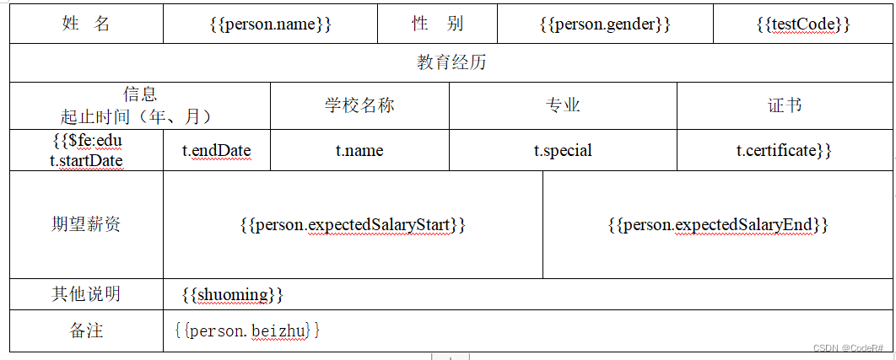

运行结果：

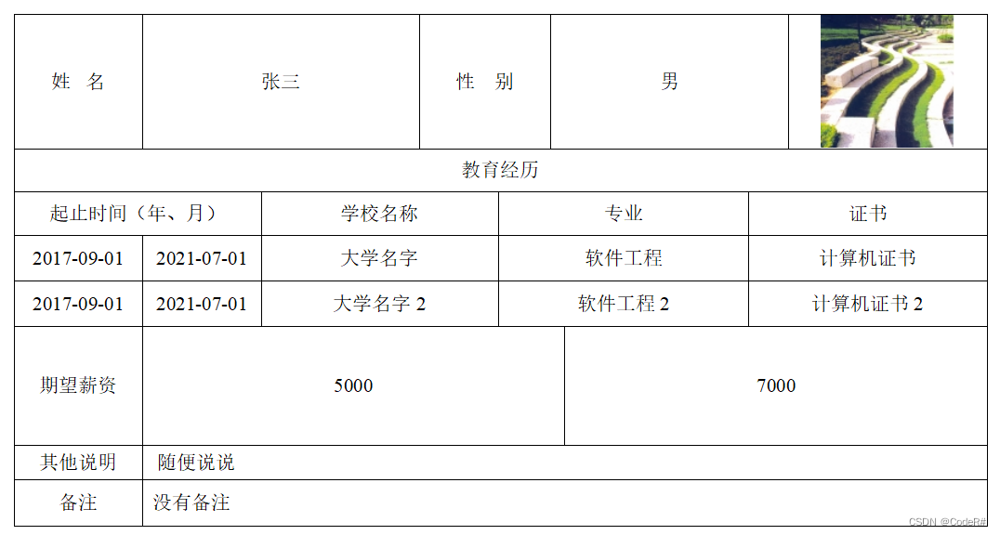

这里模板暂时存放在本地一个地方即可，如果需要将这个功能部署到线上，就需要将word模板放在项目的static的静态资源下，路径格式如下：

**需要注意的是：如果项目是父子工程的，将这个word模板放在父工程的静态资源中**

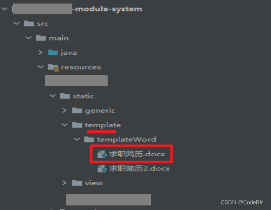

这里下面那些演示的代码，都是将模板放在 **本地**。

如果你需要放在项目静态资源中，就需要更换我代码里面的模板路径，这里是有坑的，如果难解决，欢迎评论，我会随时解决。

在[5、线上部署](#5%E3%80%81%E7%BA%BF%E4%B8%8A%E9%83%A8%E7%BD%B2%C2%A0)模块，我改为**将word模板放在静态资源**的情况，

## 3、代码

### 3.1后端代码

这些代码可以直接使用，如果有小的报错，不是核心代码问题（这些我是实际使用的demo，不会有核心代码问题），修改之后即可使用。

创建person对象和edu对象

```java
@Data
public class Person {
    private String name;
    private String gender;
    private String expectedSalaryStart;
    private String expectedSalaryEnd;
    private String beizhu;
}

@Data
public class Edu {
    private String startDate;
    private String endDate;
    private String name;
    private String special;
    private String certificate;
}
```

准备数据：（这里直接给完整代码，需要使用下面的**wordUtil**工具类，一起使用才能运行）

准备接口：

```java

import cn.afterturn.easypoi.entity.ImageEntity;
import cn.hutool.core.util.ObjectUtil;
import cn.hutool.http.HttpGlobalConfig;
import cn.hutool.http.HttpUtil;
import lombok.extern.slf4j.Slf4j;
import org.springframework.beans.factory.annotation.Autowired;
import org.springframework.beans.factory.annotation.Value;
import org.springframework.context.annotation.Lazy;
import org.springframework.core.io.ClassPathResource;
import org.springframework.scheduling.concurrent.ThreadPoolTaskExecutor;
import org.springframework.stereotype.Controller;
import org.springframework.web.bind.annotation.GetMapping;
import org.springframework.web.bind.annotation.PathVariable;
import org.springframework.web.bind.annotation.RequestMapping;
import org.springframework.web.bind.annotation.RestController;

import javax.servlet.http.HttpServletResponse;
import java.io.*;
import java.nio.file.Files;
import java.nio.file.Path;
import java.nio.file.Paths;
import java.text.SimpleDateFormat;
import java.util.*;
import java.util.concurrent.CompletableFuture;

@RestController
@RequestMapping("/person")
@Slf4j
public class ExportController {

    @Autowired
    private WordUtil wordUtil;

 /**
     * 导出简历
     */
    @GetMapping(value = "/exportWord")
    public void exportWord(HttpServletResponse response) throws IOException {

        Person person = new Person();

        person.setName("张三");
        person.setGender("男");
        person.setExpectedSalaryStart(5000);
        person.setExpectedSalaryEnd(8000);
        person.setBeizhu("没有备注");

        //需要循环遍历的数据
        List<Edu> eduList = new ArrayList<>();

        Edu edu1 = new Edu();
        edu1.setStartDate("2017-09-01");
        edu1.setEndDate("2021-07-01");
        edu1.setName("大学名字");
        edu1.setSpecial("软件工程");
        edu1.setCertificate("计算机证书");
        eduList.add(edu1);

        Edu edu2 = new Edu();
        edu2.setStartDate("2017-09-01");
        edu2.setEndDate("2021-07-01");
        edu2.setName("大学名字2");
        edu2.setSpecial("软件工程2");
        edu2.setCertificate("计算机证书2");
        eduList.add(edu2);

        //存放数据，也就是填充在word里面的值
        Map<String, Object> params = new HashMap<>();

        //使用Map类型存储数据

        params.put("person", person);

        params.put("shuoming", "随便说说");

        params.put("edu", eduList);

        //这里图片需要处理，在后面有讲解
        params.put("testCode", "这是一个图片");

        //模板路径  这里必须使用绝对路径，可以仿照我上面的模板，先练习
        String templatePath = "E:\\demo\\简历.docx";

        //生成文件名
        String fileName = new SimpleDateFormat("yyyyMMddHHmmss").format(new Date()) + "_" + System.currentTimeMillis() + ".docx";

        //保存路径
        String saveDir = "E:\\demo\\";

        // 导出Word文档为文件
        String word = wordUtil.exportWord(templatePath, saveDir, fileName, params);

        log.info("导出Word文档存放的路径", word);

    }
}
```

准备**wordUtil**工具类：

```java
import cn.afterturn.easypoi.word.WordExportUtil;
import lombok.extern.slf4j.Slf4j;
import org.apache.poi.xwpf.usermodel.XWPFDocument;
import org.springframework.stereotype.Component;
import org.springframework.util.Assert;

import java.io.*;
import java.util.Map;

@Component
@Slf4j
public class WordUtil {

    /**
     * 导出word
     * 模版变量中变量格式：{{foo}}
     *
     * @param templatePath word模板地址
     * @param saveDir      word文档保存的路径
     * @param fileName     文件名
     * @param params       替换的参数
     */
    public String exportWord(String templatePath, String saveDir, String fileName, Map<String, Object> params) {
        Assert.notNull(templatePath, "模板路径不能为空");
        Assert.notNull(saveDir, "临时文件路径不能为空");
        Assert.notNull(fileName, "导出文件名不能为空");
        Assert.isTrue(fileName.endsWith(".docx"), "word导出请使用docx格式");
//        Assert.isTrue(fileName.endsWith(".doc"), "word导出请使用docx格式");

        if (!saveDir.endsWith("/")) {
            saveDir = saveDir + File.separator;
        }

        File dir = new File(saveDir);
        if (!dir.exists()) {
            dir.mkdirs();
        }
        String savePath = saveDir + fileName;

        try {
            XWPFDocument doc = WordExportUtil.exportWord07(templatePath, params);
            FileOutputStream fos = new FileOutputStream(savePath);
            doc.write(fos);
            fos.flush();
            fos.close();
        } catch (Exception e) {
            log.error("exportWord方法出现问题", e);
            e.printStackTrace();
        }
        return savePath;
    }

}
```

工具类**SignatureUtils**：（你现在不用也没事，到后面实际开发，这个工具类可以帮你）

```java
import cn.hutool.core.collection.CollUtil;
import cn.hutool.core.convert.Convert;
import cn.hutool.core.date.DatePattern;
import cn.hutool.core.date.DateUtil;
import cn.hutool.core.date.format.DatePrinter;
import cn.hutool.core.util.ObjectUtil;
import org.apache.commons.lang.StringUtils;
import org.springframework.stereotype.Component;

import java.util.*;
import java.util.stream.Collectors;

@Component
public class SignatureUtils {

    /**
     * 时间格式化 yyyy-MM-dd
     */
    public static final DatePrinter NORM_DATE_FORMAT = DatePattern.NORM_DATE_FORMAT;

    /**
     * 时间格式化 yyyy/MM/dd
     */
    public static final String XG_DATE_FORMAT = "yyyy/MM/dd";

    /**
     * 时间格式化 yyyy年MM月dd日
     */
    public static final DatePrinter APPLY_TIME_PATTERN = DatePattern.CHINESE_DATE_FORMAT;

    /**
     * 申请时间转换 yyyy年MM月dd日
     */
    public static String applyFormatDate(Date date) {
        return DateUtil.format(new Date(), APPLY_TIME_PATTERN);
    }

    /**
     * 时间格式化 yyyy-MM-dd
     */
    public static String formatDate(Date date) {
        return date == null ? "" : DateUtil.format(date, NORM_DATE_FORMAT);
    }

    /**
     * 时间格式化 yyyy/MM/dd
     */
    public static String formatDateXg(Date date) {
        return date == null ? "无" : DateUtil.format(date, XG_DATE_FORMAT);
    }

    /**
     * 判断value是否为空，为空返回空字符串，防止空指针
     *
     * @param value
     * @return
     */
    public static Object isEmpty(Object value) {
        Object o = ObjectUtil.isEmpty(value) ? "" : value;
        return o;
    }

    /**
     * 是否
     */
    public static String isOk(Integer field) {
        if (field != null && field == 1) {
            return "是";
        }
        return "否";
    }

    /**
     * 有无
     */
    public static String isHave(String val) {
        if (Objects.nonNull(val) && "1".equals(val)) {
            return "有";
        }
        return "无";
    }

    /**
     * 性别
     */
    public static String gender(String sex) {
        if (sex == null) {
            return "无";
        }
        if ("1".equals(sex)) {
            return "男";
        } else {
            return "女";
        }
    }

}
```

到这里就可以导出简历了，如果和前端没什么交互的话，直接看[4、模板导出的坑（建议仔细浏览）](#%C2%A04%E3%80%81%E6%A8%A1%E6%9D%BF%E5%AF%BC%E5%87%BA%E7%9A%84%E5%9D%91%EF%BC%88%E5%BB%BA%E8%AE%AE%E4%BB%94%E7%BB%86%E6%B5%8F%E8%A7%88%EF%BC%89)

> 这里面写的是：代码和模板看上去没问题，但是就是填充不进去值，**依旧显示{{value}}**等这些情况。

### 3.2与前端交互

当简历导出之后，想要像在其他网站下载文件一样，右上角有一个下载完成的提示，这里就需要使用下面的代码，上面的后端核心代码不变。

#### 3.2.1后端返回数据类型

这里就是**将导出的word文档转换为二进制流**，让前端接收解析，后端的导出word代码不变，不过为了你们使用方便，我把**完整导出word和转换二进制流**全部粘出来。（把感动留在评论上）

这个接口就是上面的接口，不过在最后将导出的word转换一下数据响应类型（**二进制流）**

> 后端将导出word文档读取出来，并转换为流，放在response中，响应给前端。注意这里的响应contentType的类型

```java
 /**
     * 导出简历
     */
    @GetMapping(value = "/exportWord")
    public void exportWord( HttpServletResponse response) throws IOException {

        Person person = new Person();

        person.setName("张三");
        person.setGender("男");
        person.setExpectedSalaryStart(5000);
        person.setExpectedSalaryEnd(8000);
        person.setBeizhu("没有备注");

        //需要循环遍历的数据
        List<Edu> eduList = new ArrayList<>();

        Edu edu1 = new Edu();
        edu1.setStartDate("2017-09-01");
        edu1.setEndDate("2021-07-01");
        edu1.setName("大学名字");
        edu1.setSpecial("软件工程");
        edu1.setCertificate("计算机证书");
        eduList.add(edu1);

        Edu edu2 = new Edu();
        edu2.setStartDate("2017-09-01");
        edu2.setEndDate("2021-07-01");
        edu2.setName("大学名字2");
        edu2.setSpecial("软件工程2");
        edu2.setCertificate("计算机证书2");
        eduList.add(edu2);

        //存放数据，也就是填充在word里面的值
        Map<String, Object> params = new HashMap<>();

        //使用Map类型存储数据

        params.put("person", person);

        params.put("shuoming", "随便说说");

        params.put("edu", eduList);

        //这里图片需要处理，在后面有讲解
        params.put("testCode", "这是一个图片");

        //模板路径  这里必须使用绝对路径，可以仿照我上面的模板，先练习
        String templatePath = "E:\\demo\\简历.docx";

        //生成文件名
        String fileName = new SimpleDateFormat("yyyyMMddHHmmss").format(new Date()) + "_" + System.currentTimeMillis() + ".docx";

        //保存路径
        String saveDir = "E:\\demo\\";

        // 导出Word文档为文件
        // String word = wordUtil.exportWord(templatePath, saveDir, fileName, params);

        //log.info("导出Word文档存放的路径", word);

        //下面代码就是变化的地方

        // 导出wold
        try {
            // 导出Word文档为文件
            String word = wordUtil.exportWord(templatePath, saveDir, fileName, params);
            // 将导出的Word文件转换为流
            File file = new File(word);
            InputStream inputStream = new FileInputStream(file);

            // 将流响应给前端回显
            //这里响应类型必须是二进制流（octet-stream），才可以让前端接收并解析
            response.setContentType("application/octet-stream");
            OutputStream outputStream = response.getOutputStream();
            byte[] buffer1 = new byte[1024];
            int len1;
            while ((len1 = inputStream.read(buffer1)) > 0) {
                outputStream.write(buffer1, 0, len1);
            }
            outputStream.flush();
            outputStream.close();
            inputStream.close();
        } catch (Exception e) {
            System.out.println("导出Word文档时出现异常：" + e.getMessage());
        }

    }
```

#### 3.2.2前端代码

前端可以使用axios的get请求接收数据，在对应的按钮调用这个方法即可

这里按钮你用你当前的框架即可，我这里随便写一个演示功能

```html
 <button type="primary"  @click="exportWord"> 导出word </button>
```

这里的请求路径根据你的情况来，我这里对axios的请求前缀做了配置，你这里如果使用原生axios就直接将完整的请求url写上去就可以

```javascript
exportWord() {

//这里的请求路径根据你的情况来，我这里对axios的请求前缀做了配置，你这里如果使用原生axios就直接将完整的请求url写上去就可以

downloadFile(
            `/person/exportWord`,
            `个人信息.docx`
          )
            .then(() => {
              this.$message.success('导出成功！')   
            })
            .catch(() => {
              this.$message.error('导出失败！')   
            })
}

//这里使用的是axios导出，不能运行你就看看你前端这个的版本，或者搜搜原因，我这里是vue2，代码一定是可以用的

/**
 * 下载文件 用于excel导出
 * @param url
 * @param parameter
 * @returns {*}
 */
export function downFile(url,parameter){
  return axios({
    url: url,
    params: parameter,
    method:'get' ,
    responseType: 'blob'
  })
}

/**
 * 下载文件
 * @param url 文件路径
 * @param fileName 文件名
 * @param parameter
 * @returns {*}
 */
export function downloadFile(url, fileName, parameter) {
  return downFile(url, parameter).then((data) => {
    if (!data || data.size === 0) {
      Vue.prototype['$message'].warning('文件下载失败')
      return
    }
    if (typeof window.navigator.msSaveBlob !== 'undefined') {
      window.navigator.msSaveBlob(new Blob([data]), fileName)
    } else {
      let url = window.URL.createObjectURL(new Blob([data]))
      let link = document.createElement('a')
      link.style.display = 'none'
      link.href = url
      link.setAttribute('download', fileName)
      document.body.appendChild(link)
      link.click()
      document.body.removeChild(link) //下载完成移除元素
      window.URL.revokeObjectURL(url) //释放掉blob对象
    }
  })
}
```

到这里就完整的可以导出word文档了，如果导出的word文档里面没有被正确的填充值，可以看下面的word导出的坑[4、模板导出的坑（建议仔细浏览）](#%C2%A04%E3%80%81%E6%A8%A1%E6%9D%BF%E5%AF%BC%E5%87%BA%E7%9A%84%E5%9D%91%EF%BC%88%E5%BB%BA%E8%AE%AE%E4%BB%94%E7%BB%86%E6%B5%8F%E8%A7%88%EF%BC%89)。

### 3.3图片导出

这里依据个人情况使用......

这里建议直接使用绝对路径，将图片下载下来转换为二进制byte[]，不然路径上有图片的url存在中文会导致word导出出错。

这里可能存在网络慢，可以使用线程池解决（不用也没有太大问题，看网络情况以及导出的数据量来决定）

这里可能请求服务器的图片比较慢，就使用这个线程判断逻辑可以放在 导出word文档之前，准备数据之后（这个是等待前面线程执行完才可以执行下面的代码，也就是考虑自己的其他代码有没有处理很慢的地方，让它们并行处理，避免网络超时，所以要考虑好执行位置）

```java
person.setPhoto("这里可以填写的图片路径，我这里是请求服务器的图片");
List<CompletableFuture<Void>> resultFuture = new ArrayList<>(3);
        Person finalPerson = person;
        CompletableFuture<Void> future = CompletableFuture.runAsync(() -> {
            ImageEntity image = new ImageEntity();
            if (ObjectUtil.isNotEmpty(finalPerson.getPhoto())) {
                image.setHeight(115);
                image.setWidth(100);
                String imagePath = finalPerson.getPhoto().trim();
                if (!finalPerson.getPhoto().trim().startsWith("http")) {
//这里如果数据库存的只是图片名字，这里可以判断，添加上图片前缀，这里//根据自己的情况处理，不加这个判断逻辑代码也没问题

//这里根据自己的实际情况使用即可，但是设置完整的图片，我这里已经写好，可以直接参考
//String prefixImg = "http://localhost:8080/sys/common/static/";

                    imagePath = prefixImg + finalPerson.getPhoto().trim();
                }
                try {
                    HttpGlobalConfig.setTimeout(7000); // 设置全局超时时间为 7 秒
//这个超时时间根据自己系统配置的时间设置，小于系统超时时间即可
                    byte[] imageBytes = HttpUtil.downloadBytes(imagePath);
                    image.setData(imageBytes);
                    image.setType(ImageEntity.Data);
                } catch (Exception e) {
//                    throw new JeecgBootException("网络波动,请稍后尝试!");
                    log.error("图片不存在或者请求超时");
                    image.setUrl("");
                }
            } else {
                log.error("没有设置头像");
                image.setUrl("");
            }
            params.put("testCode", image);
        }, executor);
        resultFuture.add(future);

//这个线程判断逻辑可以放正导出文档之前，准备数据之后（这个是等待前面线程执行完才可以执行下面的代码，也就是考虑自己的其他代码有没有处理很慢的地方，让他们并行处理，避免网络超时，所以要考虑好执行位置）
CompletableFuture.allOf(resultFuture.toArray(new CompletableFuture[0])).join();

//我这里使用的线程池是spring提供的，只有一个核心线程，无界队列
@Lazy
@Autowired
private ThreadPoolTaskExecutor executor;
```

> 这里只需要将前面的 这行代码 替换 为这里写的 关于图片处理 代码即可
>
> ```java
>  //这里图片需要处理，在后面有讲解
>  params.put("testCode", "这是一个图片");
> ```
>
> 把这个代码替换掉即可。

## **4、模板导出的坑（建议仔细浏览）**

这才是写导出功能最难受的地方，各种意想不到的坑，我把当时遇到的在这里罗列一下，**欢迎大家指正、补充，**让大家在这里享受导出word文档的一条龙服务。

这些坑都可能导致被填充的值，导出之后依旧显示{{value}}，所以可以耐心看完。

### 4.1创建文件必须使用docx（2007的文档）

> 如果发现反复检查代码不能成功导出，再重新创建一个文档，可能前面创建的word是强制修改文件尾缀（这里不能强制修改，需要直接创建.docx的版本）

### 4.2被填充的值，导出之后依旧显示{{value}}

模板里面的需要填充的值，看上去没问题，但是需要注意是否为英文符号

> 1、当时我的电脑不能使用第三方输入法的中英文符号，都不能识别填充数据，
>
> 后面改为电脑自带的输入法才成功。

> 2、更加神奇的是我的这个模板却只能使用自带输入法的中文符号，只有这个可以识别出来。（后面自己猜测是因为，当时电脑输入法改为 中文 就可以输入英文符号

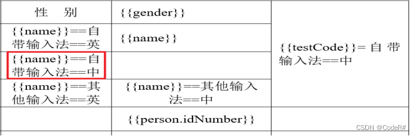

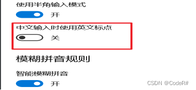

### 4.3请求得到的数据是null，直接填充给模板可能会报空指针异常

这里我准备了工具类，你可以使用，也就是上面的SignatureUtils 工具类，这里是缩减版的，可以使用前面的完整版工具类。

```java
@Component
public class SignatureUtils {

/**
 * 判断value是否为空，为空返回空字符串，防止空指针
 *
 * @param value
 * @return
 */
public static Object isEmpty(Object value) {
    Object o = ObjectUtil.isEmpty(value) ? "" : value;
    return o;
}
/**
 * 时间格式化 yyyy-MM-dd
 */
public static String formatDate(Date date) {
    return date == null ? "" : DateUtil.format(date, "yyyy-MM-dd");
}
}
```

使用方法如下：

```java
//教育经历
//用来传递给word导出的数据
Map<String, Object> params = new HashMap<>();

List<EducationExperience> experienceList = dtoById.getEdu();
List<Map<String, Object>> edu = new ArrayList<>();
//判断experienceList为非空
if (!Optional.ofNullable(experienceList).map(List::isEmpty).orElse(true)) {
    experienceList.forEach(educationExperience -> {
        Map<String, Object> map = new HashMap<>();
        map.put("startDate", SignatureUtils.formatDate(educationExperience.getStartDate()));
        map.put("endDate", SignatureUtils.formatDate(educationExperience.getEndDate()));
        map.put("name", SignatureUtils.isEmpty(educationExperience.getName()));

        edu.add(map);    });
}
params.put("edu", edu);
```

在模板中使用情况就是：

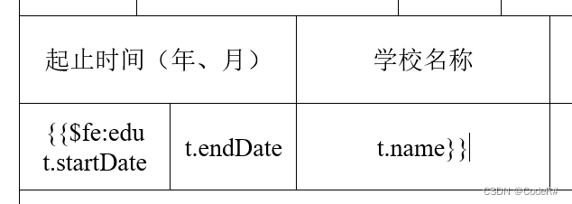

### 4.4使用  \$fe:  遍历元素时的坑：

> 1、首先就是确保**所有的符号都是英文**，（如果英文符号解决不了，可以看看前面关于这个的坑）

> 2、开头的这里{{\$fe: work2，冒号和被遍历的key中间有没有空格都可以，不过{{和\$fe:不能有空格，但是work2和后面的t.startDate中间至少有一个空格，且在这种循环遍历的情况下，一个单元格里面只能填充一个值，不然会识别错误，出现字符串索引超长问题。

> 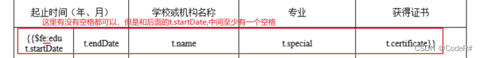
>
> **底层代码逻辑:**
>
> 会读取 \$fe: work2 t.startDate  这个，它是根据{{，这两个大括判断开始的位置，然后将work2 t.startDate（这俩中间是至少有一个空格的，其他的有没有无所谓）转换为数组，就是根据中间的空格切分，然后填充到数组里面，会取数组的第二个值，所以这里只能填充一个需要被填充的值。
>
> 不能在一个单元格里面写：{{\$fe: work2 t.startDate ~ t.endDate，这样不能识别，出现字符串索引超长问题。如果有两个值，可以像我一样划分单元格去填充即可。

> 3、使用这种循环填充值时，**被循环的值必须在第一列**
>
> 不然就无法识别，不能填充值，**下面这个写法就是不对**

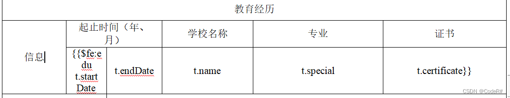

正确的写法：

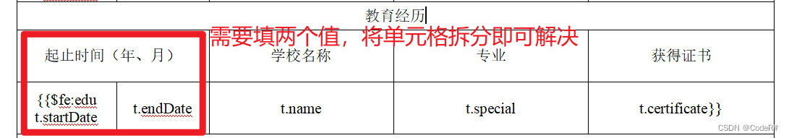

> 4、最离谱的坑。当这个模板全局存在   **遍历数据** 的情况，非遍历的单元格，里面填充两个值

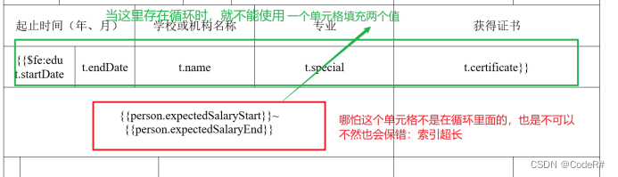

但是，当全局**没有 这种循环遍历的时候**，就可以使用**一个单元格填充两个值**（原因未知）

例如模板是这种情况，这里就不会有上面的问题：

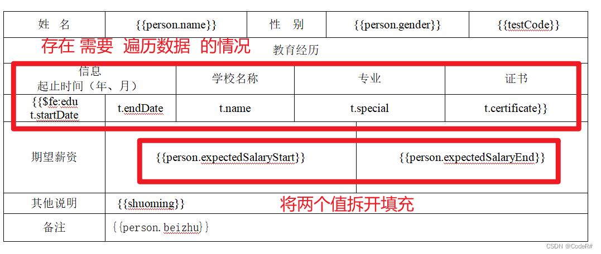

> 所以遇到**既要遍历数据，又存在 一个单元格需要填充两个值**，可以参考这个模板解决

## 5、线上部署

### 5.1将word模板放在静态资源中

需要将word模板放在项目的static的静态资源下，路径格式如下：

**需要注意的是：如果项目是父子工程的，将这个word模板放在父工程的静态资源中**


这里的接口代码也要有一些变化：

我直接把完整的这个接口代码写好，工具类用的还是 [3.1后端代码](#3.1%E5%90%8E%E7%AB%AF%E4%BB%A3%E7%A0%81)里面的wordUtil

> 这里建议最好按照我的这个写法，将静态资源的word模板读取为二进制流，然后创建文件，把这个二进制流写进去到这个创建的文件中。
>
> 这样就不会因为资源动态加载“class”文件时，可能恰巧此时没有加载到class文件，导致无法获取到word模板。

```java
 /**
     * 导出简历
     */
    @GetMapping(value = "/exportWord")
    public void exportWord( HttpServletResponse response) throws IOException {

        Person person = new Person();

        person.setName("张三");
        person.setGender("男");
        person.setExpectedSalaryStart(5000);
        person.setExpectedSalaryEnd(8000);
        person.setBeizhu("没有备注");

        //需要循环遍历的数据
        List<Edu> eduList = new ArrayList<>();

        Edu edu1 = new Edu();
        edu1.setStartDate("2017-09-01");
        edu1.setEndDate("2021-07-01");
        edu1.setName("大学名字");
        edu1.setSpecial("软件工程");
        edu1.setCertificate("计算机证书");
        eduList.add(edu1);

        Edu edu2 = new Edu();
        edu2.setStartDate("2017-09-01");
        edu2.setEndDate("2021-07-01");
        edu2.setName("大学名字2");
        edu2.setSpecial("软件工程2");
        edu2.setCertificate("计算机证书2");
        eduList.add(edu2);

        //存放数据，也就是填充在word里面的值
        Map<String, Object> params = new HashMap<>();

        //使用Map类型存储数据

        params.put("person", person);

        params.put("shuoming", "随便说说");

        params.put("edu", eduList);

        //这里图片需要处理，在后面有讲解
        params.put("testCode", "这是一个图片");

        //模板路径  这里必须使用绝对路径，可以仿照我上面的模板，先练习
        /**
         * 这个路径：是word模板在本地中
         */
        // String templatePath = "E:\\demo\\简历.docx";

        //模板在静态资源的相对路径
        String s = "static" + File.separator + "template" + File.separator + "templateWord" + File.separator + "你的模板名字.docx";

        //保存路径
        String saveDir = "E:\\demo\\";

        //获取静态资源的word模板
        ClassPathResource resource = new ClassPathResource(s);
        InputStream stream = resource.getInputStream();
        //临时文件，存储resource里面的模板内容，后面的操作都是对该临时文件的操作
        //这个路径根据自己的情况写就可以
        String tempPath = saveDir + "\\templateWord\\你的模板名字.docx";

        Path filePath = Paths.get(tempPath);
        if (!Files.exists(filePath)) { // 如果文件不存在，才需要创建文件和父目录
            Files.createDirectories(filePath.getParent()); // 创建父目录（如果不存在）
            Files.createFile(filePath); // 创建文件
        }
        try (OutputStream fos = Files.newOutputStream(filePath)) {
            byte[] buffer = new byte[1024];
            int len;
            while ((len = stream.read(buffer)) != -1) {
                fos.write(buffer, 0, len);
            }
        } finally {
            stream.close();
        }

        //生成文件名
        String fileName = new SimpleDateFormat("yyyyMMddHHmmss").format(new Date()) + "_" + System.currentTimeMillis() + ".docx";

        // 导出Word文档为文件
        // String word = wordUtil.exportWord(templatePath, saveDir, fileName, params);

        //log.info("导出Word文档存放的路径", word);

        //下面代码就是变化的地方

        // 导出wold
        try {
            // 导出Word文档为文件
            String word = wordUtil.exportWord(templatePath, saveDir, fileName, params);
            // 将导出的Word文件转换为流
            File file = new File(word);
            InputStream inputStream = new FileInputStream(file);

            // 将流响应给前端回显
            //这里响应类型必须是二进制流（octet-stream），才可以让前端接收并解析
            response.setContentType("application/octet-stream");
            OutputStream outputStream = response.getOutputStream();
            byte[] buffer1 = new byte[1024];
            int len1;
            while ((len1 = inputStream.read(buffer1)) > 0) {
                outputStream.write(buffer1, 0, len1);
            }
            outputStream.flush();
            outputStream.close();
            inputStream.close();
        } catch (Exception e) {
            System.out.println("导出Word文档时出现异常：" + e.getMessage());
        }

    }
```

这里主要不一样的代码在这里：

```java
//获取静态资源的word模板
        ClassPathResource resource = new ClassPathResource(s);
        InputStream stream = resource.getInputStream();
        //临时文件，存储resource里面的模板内容，后面的操作都是对该临时文件的操作
        //这个路径根据自己的情况写就可以
        String tempPath = saveDir + "\\templateWord\\你的模板名字.docx";

        Path filePath = Paths.get(tempPath);
        if (!Files.exists(filePath)) { // 如果文件不存在，才需要创建文件和父目录
            Files.createDirectories(filePath.getParent()); // 创建父目录（如果不存在）
            Files.createFile(filePath); // 创建文件
        }
        try (OutputStream fos = Files.newOutputStream(filePath)) {
            byte[] buffer = new byte[1024];
            int len;
            while ((len = stream.read(buffer)) != -1) {
                fos.write(buffer, 0, len);
            }
        } finally {
            stream.close();
        }

```

> **原因**：当时自己是直接读取静态资源word模板，然后将数据直接写到这个模板里面，但是会出现使用热部署插件，导致class文件有的时候拿不到word模板，
>
> 所以这里直接创建一个临时文件，避免那种情况（雪的教训，我踩的坑给你们填上）

### 5.2导出的word文档乱码

这里是因为word模板在项目打包为jar包时被压缩，这里只需要排除这种该类型文件不被压缩即可

> 在父工程中：
>
> 在对应块中添加这个代码即可，避免被压缩破坏
>
> ```java
> <build>
>         <plugins>
> 	         <!-- 避免font文件的二进制文件格式压缩破坏 -->
> 	         <plugin>
>                 <groupId>org.apache.maven.plugins</groupId>
>                 <artifactId>maven-resources-plugin</artifactId>
>                 <configuration>
>                     <nonFilteredFileExtensions>
> 						<nonFilteredFileExtension>docx</nonFilteredFileExtension>
>                     </nonFilteredFileExtensions>
>                 </configuration>
>             </plugin>
> 		</plugins>
> 	</build>
> ```
>
> 最核心的代码就是这行：
>
> ```java
> <nonFilteredFileExtension>docx</nonFilteredFileExtension>
> ```
