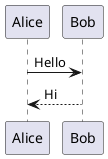
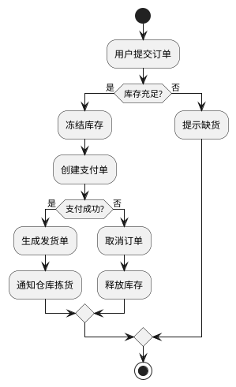
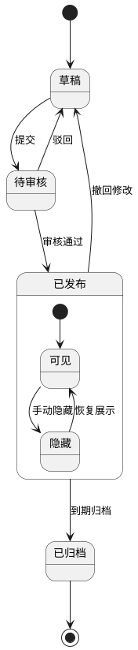
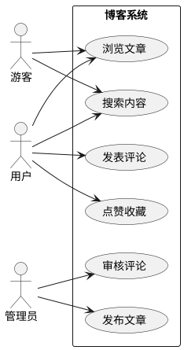
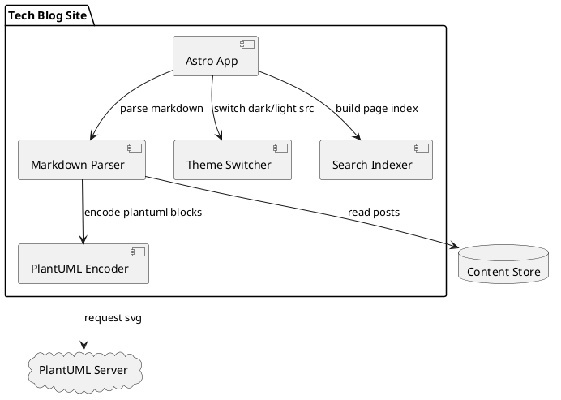
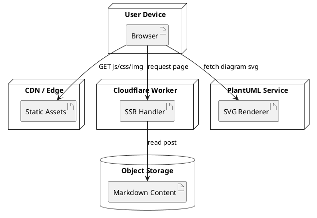
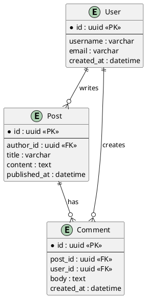
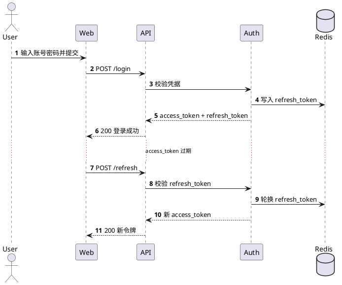

## 画 PlantUML 的速成方法与版本追溯

PlantUML 是一种使用纯文本描述图表的工具。你只需要写一段结构化语法，就可以生成时序图、类图、用例图、活动图等常见工程图。

它特别适合写在技术博客、详细设计方案、需求说明文档和接口联调文档里：

- **图表源码可以和正文一起版本管理**，便于协作与审阅
- **修改图只需要改文本**，适合频繁迭代
- <mark>可以通过 Git 管理 `.puml` 文件，直接查看每一次图表关系的调整记录</mark>
- 能和 Markdown 无缝结合，保持文档统一

## 使用背景

在整理需求说明、详细设计方案或者技术方案时，经常需要画清楚业务流程、系统边界、模块依赖、接口调用链路和状态流转。普通截图或者手动画图后期维护成本比较高，一旦流程改动，就要重新拖拽调整。

PlantUML 更适合这类需要长期维护的技术文档：**图表本身就是文本**，可以跟代码和文档一起提交到 Git，评审时也能直接看到具体改了哪条关系。对后端接口、前后端联调、部署链路、权限流程这类内容来说，用文本维护图表会更稳定。

如果把图表单独保存成 `.puml` 文件，后续可以直接通过 `git diff` 查看这张图每次改了哪些节点、哪些关系、哪些流程判断。<mark>这比只保存一张导出的图片更适合长期迭代</mark>，尤其适合需求反复调整、详细设计多轮评审的场景。

## 常用渲染方式

常用方式主要有三种：

- **在线渲染**：可以使用 [PlantText](https://www.planttext.com/) 这类在线工具，把 PlantUML 语法粘贴进去后直接预览和导出图片。
- **IDEA 插件**：在 IDEA 中安装 PlantUML 相关渲染插件，新建 `.puml` 类型文件，按 `@startuml` 和 `@enduml` 包裹图表内容，就可以在编辑器里预览渲染效果。部分图表可能还需要本机安装 Graphviz。
- **Markdown 文章**：在 Markdown 中使用 `plantuml` 代码块，把图表和文章内容放在一起，适合写技术博客或项目文档。

如果你想快速上手，可以记住这个最小模板：

````md

````

上面是文章里真正写进去的源码。下面再放一份渲染效果，方便对照：


## 活动图示例



## 状态图示例



## 用例图示例



## 组件图示例



## 部署图示例



## ER 图示例



## 时序图示例（登录与刷新令牌）



## C4 风格容器图示例

```plantuml
@startuml
!includeurl https://raw.githubusercontent.com/plantuml-stdlib/C4-PlantUML/master/C4_Container.puml

Person(user, "博客访客", "阅读文章与搜索内容")

System_Boundary(system, "Tech Blog") {
	Container(web, "Web App", "Astro + Svelte", "渲染页面与交互")
	Container(worker, "SSR Worker", "Cloudflare Workers", "处理服务端渲染请求")
	ContainerDb(content, "Content Store", "Markdown / Object Storage", "存储文章与资源元数据")
	Container(search, "Search Index", "Pagefind", "提供全文检索")
}

System_Ext(plantuml, "PlantUML Server", "生成 SVG 图表")

Rel(user, web, "访问", "HTTPS")
Rel(web, worker, "请求 SSR 页面", "HTTPS")
Rel(worker, content, "读取文章")
Rel(web, search, "查询关键词")
Rel(web, plantuml, "请求图表 SVG")

LAYOUT_LEFT_RIGHT()
@enduml
```
