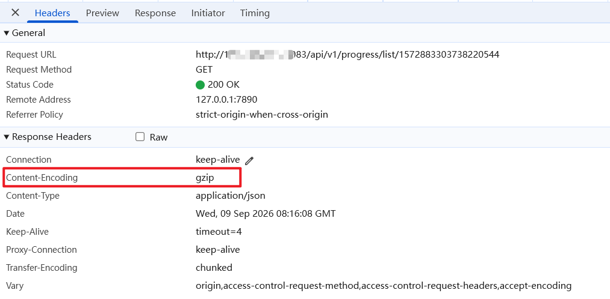
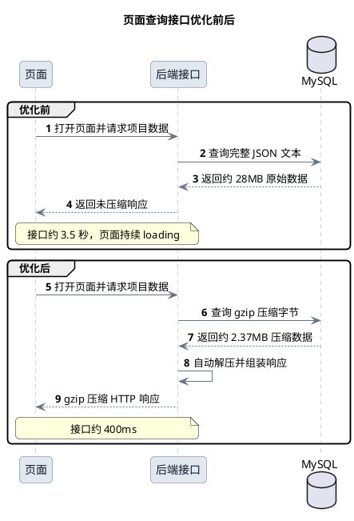
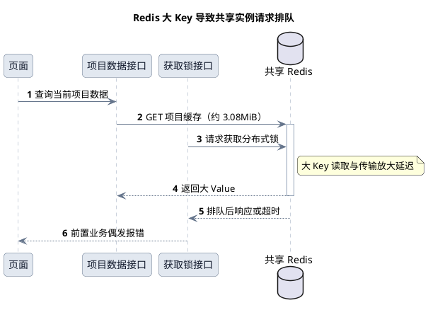

SQL 已经命中索引，`SELECT` 里没有 `*`，返回的也都是页面真正需要的字段。数据只有 1802 行，查询却仍然耗时约 **2.5 秒**，页面接口整体需要 **3.5 秒**。

更反直觉的是：查询条件和返回行数都不变，只临时去掉一个业务必需的 `table_value` 字段，SQL 就降到了约 **150ms**。这个字段里到底装了什么，为什么索引和“按需查询”都救不了它？

继续给 SQL 加索引、把整份数据塞进 Redis，还是直接改成分页？这篇文章复盘一次真实排查：如何确认瓶颈来自约 **28MB 的大字段 JSON**，怎样把接口降到约 **400ms**，以及一次 Redis 大 Key 优化为什么又拖慢了其他业务。

<mark>当 SQL 已经“只查必要字段”时，还要继续追问：这些必要字段到底有多大。</mark>

## 目录

- 一、先说结论：这次优化解决了什么
- 二、真实场景：页面为什么一直 loading
- 三、定位过程：慢的不是查询条件，而是大字段
- 四、几种优化策略怎么选
- 五、最终采用的三层优化
- 六、一次踩坑：为什么没有继续使用 Redis 缓存
- 七、优化前后的完整链路
- 八、实测结果
- 九、上线时怎么避免数据问题
- 十、适用边界与后续方向
- 总结

## 一、先说结论：这次优化解决了什么

这次处理的是一个页面初始化接口。用户打开页面后，需要等待后端查询当前项目的数据并返回完整 JSON。接口优化前耗时约 **3.5 秒**，页面会一直停留在 loading 状态，偶尔还会因为依赖 Redis 的前置接口超时而直接报错。

最终没有继续堆缓存，也没有盲目调整 SQL，而是从数据源头、数据库存储和 HTTP 传输三个位置减少无效数据：

| 环节 | 优化前 | 优化后 |
| --- | --- | --- |
| JSON 内容 | 保留大量空字段 | 录入、导入时过滤无意义空字段 |
| 数据库存储 | `table_value` 保存完整 JSON 文本 | gzip 压缩后存入 `LONGBLOB` |
| 数据读取 | 数据库返回完整大字段 | 返回压缩字节，后端统一解压 |
| HTTP 传输 | 直接返回 JSON 响应 | 后端与 Nginx 开启 gzip |
| 接口耗时 | 约 3.5 秒 | 约 400ms |

<mark>这次最重要的经验不是“gzip 能提速”，而是大字段接口要先减少整条链路搬运的字节数，不能把数据库的问题简单转移到 Redis。</mark>

## 二、真实场景：页面为什么一直 loading

业务表中有一个 `table_value` 字段，用来保存页面所需的完整 JSON。它不是日志或临时数据，而是页面展示和后续处理都要使用的核心内容，不能直接从查询结果中删除。

当时的数据体量如下：

| 数据指标 | 实际体量 |
| --- | --- |
| 单项目记录数 | 约 2000 行 |
| 本次对照测试数据 | 1802 行 |
| `table_value` 单条平均大小 | 约 13KB |
| `table_value` 单条最大值 | 接近 800KB |
| 同批数据原始体积 | 约 28MB |

2000 行看起来不多，但普通列表字段可能只有几十或几百字节，这批数据平均每行携带约 13KB JSON，极端记录接近 800KB。一次请求需要让这批数据走完整条链路：

```text
MySQL 磁盘与 Buffer Pool
        -> MySQL 结果集
        -> JDBC 驱动
        -> Java 对象
        -> JSON 序列化
        -> HTTP 响应
        -> 浏览器解析和渲染
```

因此，用户看到的“页面一直 loading”，并不只是 SQL 执行慢，而是数据库、应用和网络都在反复搬运同一批大字段。

## 三、定位过程：慢的不是查询条件，而是大字段

一开始最容易怀疑的是索引、关联条件或执行计划。这一步不能只看表上“好像建过索引”，还是要以实际执行计划为准。

当时在数据库客户端里执行的 SQL 整理如下，项目 ID 已做脱敏：

```sql
SELECT COUNT(1)
FROM icdt_project_json_data
WHERE project_id = ?;
-- 返回 1802

EXPLAIN
SELECT project_json_data_id,
       table_value,
       unique_key,
       project_id
FROM icdt_project_json_data
WHERE project_id = ?;
```

`EXPLAIN` 中与这次排查直接相关的结果如下：

| select_type | type | possible_keys | key | key_len | ref | rows | filtered |
| --- | --- | --- | --- | --- | --- | --- | --- |
| SIMPLE | ref | `idx_project_id` | `idx_project_id` | 9 | const | 1802 | 100.00 |

`SHOW INDEX` 也能确认 `idx_project_id` 的索引列就是 `project_id`。执行计划使用了该索引，访问类型为 `ref`，预估读取 1802 行，并不是全表扫描。

问题也正在这里：**索引解决的是“怎么找到这 1802 行”，解决不了“找到以后每行要搬多少数据”。**

为了确认耗时来源，做了一个诊断测试：查询条件、返回行数保持不变，只是不读取 `table_value`。结果查询耗时下降到约 **150ms**。

| 测试方式 | 查询耗时 | 说明 |
| --- | --- | --- |
| 查询完整字段 | 约 2.5 秒 | 包含约 28MB JSON 数据 |
| 不读取 `table_value` | 约 150ms | 查询条件、记录数基本不变 |

这个结果说明问题方向已经比较明确：

- 定位目标数据不是主要瓶颈；
- 返回 1802 行本身不是主要瓶颈；
- `table_value` 的读取、复制和传输才是主要耗时来源。

需要特别说明，**不读取 `table_value` 只是定位手段，不是优化方案**。页面确实依赖这个字段，直接删掉只会让功能不完整。

## 四、几种优化策略怎么选

定位到大字段后，方案不能只看“能不能让当前接口变快”，还要看是否把压力转移给共享组件。

| 方案 | 能解决什么 | 本次结论 | 实测结果或限制 |
| --- | --- | --- | --- |
| 继续增加索引 | 降低数据定位成本 | 不采用 | 已命中 `idx_project_id`，无法减少大字段读取量 |
| 页面改成分页或按需加载 | 降低单次返回量 | 后续可评估 | 会改变页面交互和接口契约 |
| 缓存完整项目 JSON | 避免重复查询 MySQL | 撤回 | 形成约 3.08MiB 大 Key，影响共享 Redis |
| 继续调大 Redis 超时 | 延长客户端等待时间 | 不采用 | 没有解决排队，故障暴露得更慢 |
| 写入时过滤空字段 | 减少原始 JSON 体积 | 采用，辅助 | 28MB 降到 14.79MB，减少约 47.2% |
| 库内保存 gzip 数据 | 减少存储和数据库读取量 | 采用，核心 | 14.79MB 降到 2.37MB，SQL 从 1.4 秒降到 360ms |
| 开启 HTTP gzip | 减少应用到浏览器的流量 | 采用，辅助 | 与空字段过滤同轮测试，没有单独拆分收益 |

## 五、最终采用的三层优化

### 5.1 第一层：写入时过滤无意义空字段

前端录入和批量导入时，先去掉没有业务含义的 `null`、空字符串和空集合，但要保留 `0`、`false` 等有效值。

同一批 1802 条数据处理后，原始体积从约 **28MB 降到 14.79MB**，降幅约 **47.2%**。对应的 SQL 查询从 **2.5 秒降到 1.4 秒**，下降约 **44%**。

这一步最简单，但收益会传递到后续所有环节：数据库少存、查询少读、Java 少处理、网络少传输。需要注意，这一轮同时启用了 HTTP gzip，接口从 **3.5 秒降到 1.6 秒** 是两项措施的组合结果，不能全部算在空字段过滤上。

### 5.2 第二层：库内 gzip 压缩存储

JSON 中字段名、固定配置和层级结构重复度高，适合 gzip 压缩。最终将 `table_value` 调整为 `LONGBLOB`：写入时压缩为字节，读取时在持久化转换层自动解压，Service 层仍然拿到普通 JSON 字符串。

核心逻辑可以概括为下面这段伪代码：

```text
写入：
    cleanedJson = 删除无意义空字段(originalJson)
    compressedBytes = gzip(UTF8(cleanedJson))
    保存 compressedBytes 到 LONGBLOB

读取：
    bytes = 查询 table_value
    if bytes 带 gzip 文件头:
        json = gunzip(bytes)
    else:
        json = UTF8(bytes)  // 兼容迁移前的历史数据
    返回 json
```

压缩逻辑应放在统一的数据转换层，不要散落在每个 Service 方法中。这样业务代码不需要知道数据库里保存的是文本还是压缩字节。

在上一轮优化不变的情况下，加入库内 gzip 后，按本次统计口径，数据体积从 **14.79MB 降到 2.37MB**，减少约 **84.0%**；SQL 从 **1.4 秒降到 360ms**，下降约 **74.3%**；接口从 **1.6 秒降到约 400ms**，又下降了 **75%**。

1802 条数据的解压总耗时约 **47ms**。相对于这一轮省下的约 1.2 秒接口耗时，解压开销不到 4%，这笔 CPU 开销可以接受。

### 5.3 第三层：开启 HTTP 响应 gzip

库内压缩解决的是 MySQL 到应用的搬运成本，HTTP gzip 解决的是应用到浏览器的传输成本，两者作用位置不同。

后端和 Nginx 都可以配置响应压缩，但上线后要检查响应头中的 `Content-Encoding: gzip`，确认至少一层生效。不要只看配置文件就判断压缩已经工作。



这次没有保留“只开 HTTP gzip”的单独测试组，所以不写一个看似精确的独立提升比例。能确认的是，它只减少应用到浏览器的响应传输，**不会让 MySQL 少读取一字节 `table_value`**，因此定位上一直是辅助措施。

## 六、优化前后的完整链路



## 七、实测结果

下面的数据来自同一批 1802 条记录。后一阶段保留前一阶段的措施，只新增下一层优化，避免拿不同项目的数据横向拼接。

| 指标 | 优化前 | 第一轮：空字段过滤 + HTTP gzip | 第二轮：再加入库内 gzip |
| --- | --- | --- | --- |
| 数据体积 | 约 28MB | 14.79MB | 2.37MB |
| SQL 查询耗时 | 2.5 秒 | 1.4 秒 | 360ms |
| 接口整体耗时 | 3.5 秒 | 1.6 秒 | 约 400ms |
| 解压 CPU 耗时 | 无 | 无 | 单条 0.008～0.47ms，总计约 47ms |

把每一步相对上一阶段的收益展开后会更直观：

| 对比阶段 | 数据体积 | SQL 查询耗时 | 接口整体耗时 | 可以得出的结论 |
| --- | --- | --- | --- | --- |
| 优化前 → 第一轮 | 减少约 47.2% | 下降约 44.0% | 下降约 54.3% | 空字段过滤有效；接口收益包含同轮启用的 HTTP gzip |
| 第一轮 → 第二轮 | 再减少约 84.0% | 再下降约 74.3% | 再下降约 75.0% | 其他条件不变，库内 gzip 是收益最大的单项措施 |
| 优化前 → 最终 | 累计减少约 91.5% | 累计下降约 85.6% | 累计下降约 88.6% | SQL 约快 6.9 倍，接口约快 8.8 倍 |

<mark>接口整体耗时从 3.5 秒降到约 400ms，接近 9 倍提升；其中库内压缩是收益最大的单项措施。</mark>

这里没有把所有收益都归给 gzip。第一轮是“空字段过滤 + HTTP gzip”的组合测试，缺少单独的 HTTP gzip 对照组；第二轮只新增库内压缩，因此 **1.6 秒到 400ms** 这部分收益才可以直接用来判断库内压缩的效果。2.37MB 沿用本次测试的统计口径，表示组合优化后的压缩数据体积，不等于浏览器解压后 JSON 在内存中的大小。


## 八、一次踩坑：为什么没有继续使用 Redis 缓存

大字段查询慢时，一个很自然的想法是把当前项目数据放进 Redis，下次打开页面直接读取缓存。

当时项目里确实有人这样处理过，但运行一段时间后出现了新的问题：<mark>依赖 Redis 的接口开始偶发超时，其中包括获取锁等前置业务。</mark>

最初 Redis 客户端调用超时约为 2 秒，后来已经放宽到 5 秒，但问题仍然存在。继续增加超时时间只能让请求等得更久，并不能消除阻塞和排队。

排查后发现，缓存的是整个项目 JSON。使用 `STRLEN` 查看其中一个 Key，结果为 **3,227,173 字节**，约 **3.08MiB**，也就是平时说的 3MB 左右。


### 8.1 一个 3MB Key 为什么会影响其他接口

Redis 很快，但它并不适合无条件保存和频繁读取大对象。即使使用的是简单 `GET`，一次读取 3MB 数据仍然要经过：

```text
Redis 查找 Key
    -> 组织大 Value 响应
    -> 写入客户端输出缓冲区
    -> 网络传输 3MB 数据
    -> Java 客户端读取与分配内存
    -> JSON 反序列化
```

Redis 命令执行仍以主线程串行为主。单次大 Key 操作不一定必然执行 5 秒，但在并发访问、网络波动或实例负载较高时，会明显放大主线程、网络和客户端输出缓冲区压力，造成请求排队和尾延迟。

更麻烦的是，这不是一个独立 Redis 实例。页面数据缓存与分布式锁等前置能力共享资源，于是一个非核心的大对象缓存，反过来拖慢了更关键的业务请求。



### 8.2 为什么把超时从 2 秒改成 5 秒仍然没用

超时配置只是调用方愿意等待多久，不会提升 Redis 的处理能力。当后端持续读取大 Key 时，调大超时可能带来三个副作用：

- 更多请求留在等待队列中；
- Web 线程和 Redis 连接被占用更久；
- 故障从快速失败变成长时间 loading 后失败。

所以这次最终把整份项目数据缓存逻辑下掉了。**缓存不是不能用，而是不能让一个数 MB 的大 Value 与锁、会话等关键数据共享同一条资源链路。**

### 8.3 排查 Redis 大 Key 时可以看什么

| 手段 | 作用 | 注意点 |
| --- | --- | --- |
| `STRLEN key` | 查看 String Value 的字节长度 | 不包含 Redis 对象内部开销 |
| `MEMORY USAGE key` | 估算 Key 实际占用内存 | 生产环境避免高频扫描 |
| `redis-cli --bigkeys` | 按数据类型发现大 Key | 扫描大实例前先评估影响 |
| `SLOWLOG GET` | 查看慢命令 | 网络传输和客户端等待不一定完整体现在其中 |
| 延迟与连接池监控 | 观察尾延迟、活跃连接和超时 | 平均耗时正常不代表没有偶发尖峰 |


## 九、上线时怎么避免数据问题

大字段从文本改成压缩字节，不适合直接执行 DDL 后一次性切换。比较稳妥的顺序是：

1. 备份数据，在测试环境验证中文、空值和最大记录；
2. 字段调整为 `LONGBLOB`，先上线兼容旧文本的读取逻辑；
3. 新数据直接压缩写入，读取同时支持旧文本和新 gzip 数据；
4. 按主键范围或项目分批回填历史记录；
5. 已带 gzip 文件头的数据直接跳过，保证任务可重入；
6. 每批校验记录数、解压结果和压缩前后体积；
7. 观察 SQL、解压、序列化、接口总耗时以及应用 CPU。

如果解压失败，应该记录数据主键并抛出明确异常，不能静默返回空字符串，否则性能问题会变成数据问题。

## 十、适用边界与后续方向

### 10.1 适合使用库内压缩的场景

- JSON、XML、文本配置等重复结构较多的大字段；
- 数据库不需要检索 JSON 内部字段；
- 字段读取频率高，数据库和网络 I/O 压力明显；
- 希望压缩过程对业务层透明。

### 10.2 不适合直接压缩的场景

- 需要使用 MySQL JSON 函数查询内部内容；
- 经常根据 JSON 内部字段过滤、排序或建立索引；
- 单条数据很短，压缩收益小于 CPU 和格式开销；
- 其他系统需要绕过应用直接读取数据库内容。

### 10.3 Redis 什么时候还能考虑

不是所有缓存都要否定。如果后续仍需要缓存，可以先满足这些条件：

- 只缓存页面真正需要的摘要或热点字段；
- 对大对象做拆分，避免单个 Value 达到数 MB；
- 评估压缩、TTL、更新一致性和缓存击穿；
- 大对象缓存与锁、会话等关键数据使用不同实例或资源池；
- 上线前压测并观察 P95、P99，而不是只看平均响应时间。

如果页面不需要一次拿到全部 2000 行，**分页或按需加载通常比压缩和缓存更彻底**。本次保留全量返回，是因为现有页面和接口契约确实依赖完整项目数据。

### 10.4 仍然要关注 JVM 内存

库内压缩减少的是存储和传输成本，数据解压后仍会恢复成完整字符串并进入 JVM。如果以后单项目从 2000 行增长到几十万行，就需要继续考虑分页、游标读取、流式输出或调整页面交互，不能只依赖 gzip。

## 总结

这次问题表面上是“打开页面一直 loading”，实际包含两个相互关联的坑：

1. MySQL 每次需要读取约 28MB 大字段数据，接口整体耗时约 3.5 秒；
2. 为了绕过慢查询而缓存整份项目数据，又产生约 3.08MiB 的 Redis 大 Key，连带影响获取锁等共享 Redis 接口。

最终没有继续增加 Redis 超时，也没有把缓存当成万能解法，而是回到数据本身：先过滤无意义字段，再压缩库内数据，最后压缩 HTTP 响应。接口整体耗时下降到约 400ms，同时避免了大 Key 对共享 Redis 的干扰。

对这类问题，最值得保留的排查顺序是：**先确认慢在数据定位还是数据搬运，再比较每个方案把压力放到了哪里。** 如果一个优化只是把 MySQL 的压力转移到 Redis，它通常还不算真正解决了问题。
