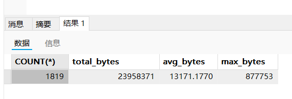
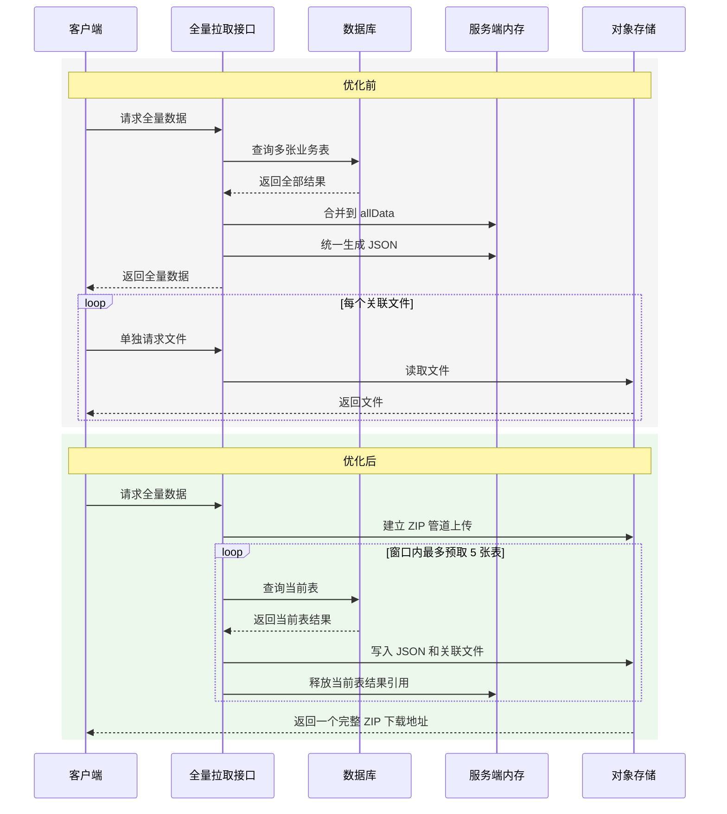

## 目录

- 一、先说结论：这次用了什么技术，解决了什么问题
- 二、什么是滑动窗口
- 三、真实背景：为什么一次拉取要 20 分钟
- 四、原来的实现为什么容易 OOM
- 五、实际怎么优化
- 六、优化前后流程对比
- 七、优化后的结果
- 八、当前方案的边界
- 总结

## 一、先说结论：用了什么技术，解决了什么问题

这次优化针对的是**离线客户端全量拉取数据**的场景。原实现一次性查询多张业务表，将所有结果合并到 `allData`，生成 JSON 后，客户端还要单独下载关联文件。

本次实际落地了四个改动：

| 技术 | 解决的问题 |
| --- | --- |
| 表级滑动窗口 | 限制同时查询的表数量，降低 JVM 和数据库瞬时压力 |
| 按表写入 ZIP | 写完一张表就释放这张表的结果 |
| 管道流上传 ZIP | ZIP 生成和对象存储上传同时进行，减少等待和额外缓存 |
| 关联文件直接写入 ZIP | 客户端只下载一个 ZIP，不再逐个请求文件 |

<mark>本次优化解决的重点是“多表全量聚合造成的内存和耗时问题”，不是单表分页或数据库游标改造。</mark>

## 二、什么是滑动窗口

滑动窗口可以理解成：**限制同时处理的数据量，只保留一个固定大小的“窗口”**。

假设一共有很多张表，但窗口大小设置为 5，那么每次最多只预取 5 张表：

```text
第一次：表1、表2、表3、表4、表5
             ↓ 写完表1
第二次：表2、表3、表4、表5、表6
             ↓ 写完表2
第三次：表3、表4、表5、表6、表7
```

写完表 1 后，窗口向后移动，补进表 6；写完表 2 后，再补进表 7。因为窗口会不断向后移动，所以称为“滑动窗口”。

它是一个折中方案：相比全部并发，能降低内存和数据库压力；相比完全串行，又能保留部分查询并发。

当前实现的预取数量是 5。这个数字只是当前配置，不是固定答案，实际项目需要结合 JVM 内存、数据库负载和并发请求量压测。

## 三、真实背景：为什么一次拉取要 20 分钟

这里不是普通分页，而是离线客户端首次启动或刷新本地数据时，向服务端拉取多张业务表的全量数据。部分表还关联了 Schema 文件，原来由客户端再单独请求下载。

实际数据量并不小，其中一张表大约有 50 万条记录，单行数据也可能比较大。

原来的链路是：

```text
客户端请求全量数据
        ↓
服务端查询多张业务表
        ↓
合并所有结果并生成 JSON
        ↓
客户端保存数据
        ↓
客户端再单独下载多个关联文件
```

当时的耗时大致可以拆成三部分：

| 阶段 | 耗时 |
| --- | --- |
| 全量拉取接口本身，包含查询和数据处理 | 约 4 分钟 |
| 客户端继续单独下载关联文件 | 每个文件平均约 1.5 分钟 |
| 整体耗时 | 平均接近 20 分钟 |

关联文件平均每个约 1.5 分钟，文件数量较多时，后续下载时间会不断叠加。也就是说，**接口本身慢，客户端还要重复发起文件请求**，最终把整体等待时间拉到了 20 分钟左右。

## 四、原来的实现为什么容易 OOM

原来的核心逻辑可以抽象成：

```java
Map<String, List<Map<String, Object>>> allData = new LinkedHashMap<>();

for (String tableName : tableNameList) {
    List<Map<String, Object>> rows = queryTable(tableName);
    allData.put(tableName, rows);
}

writeAllDataToJson(allData);
```

这意味着所有表查询完成前，结果都会一直挂在 `allData` 中。

内存中可能同时存在：

```text
多张表的 List<Map<String, Object>>
        + allData 大 Map
        + JSON 序列化产生的 byte[]
        + ZIP 和上传过程中的缓冲区
```

如果一次查询接近 30 张表，其中部分表有几十万条记录，甚至接近 50 万条，内存峰值就会明显增加。

排查时对单表做过体积统计，下面是其中一个结果示例：



数据库中的数据映射成 Java 对象后，还会产生 `Map`、`List`、字段对象和序列化缓冲区等额外开销。因此，**数据库文件大小不等于 JVM 实际需要的内存大小**。

## 五、实际怎么优化

### 1. 不再使用 `allData` 保存全部结果

优化后按表处理：

```text
查询当前表
    ↓
写入当前表 JSON
    ↓
写入当前表关联文件
    ↓
当前表处理完成
    ↓
继续下一张表
```

当前表写入完成后，不再把它放在一个全局大 Map 中等待后续处理。这样内存峰值不再直接跟所有表总数据量绑定。

### 2. 用滑动窗口限制预取数量

简化后的实现如下：

```java
int windowSize = 5;
int nextIndex = 0;
Map<String, CompletableFuture<List<Map<String, Object>>>> window = new LinkedHashMap<>();

while (nextIndex < tableNameList.size() || !window.isEmpty()) {
    while (nextIndex < tableNameList.size() && window.size() < windowSize) {
        String tableName = tableNameList.get(nextIndex);
        CompletableFuture<List<Map<String, Object>>> future =
                CompletableFuture.supplyAsync(() -> queryTable(tableName), queryExecutor);
        window.put(tableName, future);
        nextIndex++;
    }

    Map.Entry<String, CompletableFuture<List<Map<String, Object>>>> currentEntry =
            window.entrySet().iterator().next();
    String tableName = currentEntry.getKey();
    CompletableFuture<List<Map<String, Object>>> future = currentEntry.getValue();
    window.remove(tableName);

    List<Map<String, Object>> rows = future.get();
    writeTableToZip(zipOutputStream, tableName, rows);
}
```

这段代码表达的不是“每次查询 5 条数据”，而是**每次最多预取 5 张表**。当前优化控制的是表级并发，不是单表分页。

### 3. 使用管道流边生成边上传 ZIP

ZIP 不需要先完整生成到内存后再上传，而是通过管道流连接写入端和上传端：

```text
ZIP 写入线程
    ↓
PipedOutputStream
    ↓
PipedInputStream
    ↓
对象存储上传
```

写入多少，上传端就读取多少。这样可以减少完整 ZIP 包在内存中的停留时间。

### 4. 关联文件直接写入 ZIP

服务端读取关联文件的输入流，直接写成 ZIP 内的目录和文件：

```text
full-pull.zip
├── syncTime.json
├── table-a.json
├── table-b.json
└── schema-files/
    ├── schema-001/
    │   ├── schema.xsd
    │   └── schema.json
    └── schema-002/
        ├── schema.xsd
        └── schema.json
```

客户端最后只需要下载一个 ZIP，解压后按目录读取 JSON 和 Schema 文件，不再为每个文件单独发起请求。

## 六、优化前后流程对比



图中最重要的变化有两个：

1. **内存中不再长期保存所有表的结果。**
2. **关联文件由服务端一起放入 ZIP，客户端只下载一次。**

## 七、优化后的结果

在本次数据规模和测试环境下，优化后的全量拉取接口耗时约为 18 秒。这个数据是本次实测结果，不代表所有环境和数据量都能达到相同数值。

| 指标 | 优化前 | 优化后 |
| --- | --- | --- |
| 数据组织 | 所有表合并到 `allData` | 按表查询、按表写入 |
| 查询策略 | 多张表同时查询 | 滑动窗口最多预取 5 张表 |
| JSON 处理 | 全部查完后统一生成 | 当前表查询完成后立即写入 |
| 关联文件 | 客户端单独多次下载 | 服务端直接写入 ZIP |
| ZIP 上传 | 生成完成后再上传 | 管道流边生成边上传 |
| 整体耗时 | 平均接近 20 分钟 | 本次实测约 18 秒 |

这次结果不能简单归因于某一个点：

- **滑动窗口**降低了多表并发查询和 `allData` 聚合带来的内存压力。
- **按表写入**缩短了数据从查询到文件落地的等待链路。
- **关联文件打包**减少了客户端多次请求和下载的时间。

## 八、当前方案的边界

### 1. 单张超大表仍然可能占满内存

当前 Mapper 仍然返回：

```java
List<Map<String, Object>>
```

所以，滑动窗口只能限制“同时处理几张表”，不能限制“一张表一次返回多少行”。如果某张表本身就非常大，它仍然可能在一次查询时占用大量内存。

这部分目前还没有改造。如果后续出现单表过大导致内存不足，再考虑按批次读取、分页写入或数据库流式读取。**这些都不是本次已经使用的方案。**

### 2. 滑动窗口不等于一致性快照

本次优化解决的是性能和内存问题，不会自动保证所有表来自同一时刻。

如果全量拉取期间数据库仍在更新，可能出现：

```text
表A先读取
    ↓
数据库发生更新
    ↓
表B后读取
```

如果业务要求严格一致，后续需要单独设计版本号、导出会话或快照机制。不要简单把整个导出过程包进一个长事务，否则可能增加数据库连接、MVCC 和 Undo 压力。

### 3. 窗口大小需要压测

窗口越小，内存和数据库压力越低，但并发收益也越小；窗口越大，接口可能更快，但单次请求的资源占用会上升。

建议观察：

| 指标 | 关注点 |
| --- | --- |
| 接口耗时 | 是否真正缩短 |
| JVM 峰值内存 | 是否频繁 GC |
| 数据库 CPU 和连接数 | 是否被全量拉取压满 |
| ZIP 上传速度 | 是否出现管道阻塞 |
| 并发全量请求 | 多个用户同时拉取时是否稳定 |

## 总结

这次问题的本质是：**多张表全量查询时，所有结果长期堆在 `allData` 中，客户端还要额外下载多个关联文件。**

最终采用的方案是：

1. 按表查询、按表写入，不再合并全量 `allData`。
2. 使用表级滑动窗口，当前最多预取 5 张表。
3. 使用管道流边生成边上传 ZIP。
4. 将关联 Schema 文件直接写入 ZIP，客户端只下载一次。

接口整体耗时从平均接近 20 分钟降到本次实测约 18 秒，JVM 内存峰值也从“所有表结果叠加”降为“窗口内表结果加当前写入缓冲”。

<mark>滑动窗口解决的是多表并发和内存峰值问题；单表过大仍需要分批读取或流式写入，不能把两类问题混为一谈。</mark>
