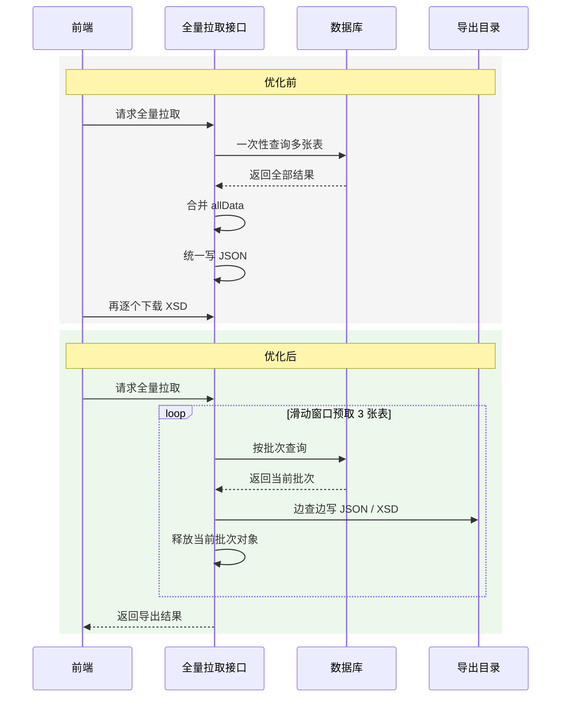

## 目录

- 一、先说结论：这次优化解决了什么
- 二、问题场景：全量拉取接口为什么容易 OOM
- 三、原来的写法有什么问题
- 四、为什么用滑动窗口做折中
- 五、核心实现思路
- 六、优化后的效果
- 七、还没彻底解决的边界
- 总结

## 一、先说结论：这次优化解决了什么

这次优化主要解决的是一个全量拉取接口的内存和耗时问题。

| 问题 | 优化前 | 优化后 |
| --- | --- | --- |
| 数据查询 | 先把所有表结果合并到 `allData` 大 Map | 按表查询，写完一张表就释放 |
| 文件写入 | 查完全部数据后再写 JSON 文件 | 边读数据库边写 JSON 文件 |
| 并发策略 | 多张表一起查，速度快但内存压力大 | 滑动窗口控制，最多预取 3 张表 |
| XSD 压缩包 | 前端单独拉取多个压缩包 | 后端一起写入文件夹，前端不再单独请求下载 |
| 接口耗时 | 平均约 20 分钟 | 优化到约 18 秒 |

<mark>核心变化：不再把所有表数据都堆到 JVM 内存里，而是用滑动窗口控制预取数量，边查询、边写文件、边释放对象。</mark>

## 二、问题场景：全量数据导出为什么容易 OOM

当时的全量拉取接口需要从多张表读取数据，再生成 JSON 文件，同时还要处理对应的 XSD 压缩包。这个业务来自某个控制器里的全量拉取接口，真实代码已经脱敏，这里只保留优化思路。

原来的链路大概是这样：

```text
查询 29 张表数据 -> 合并到 allData 大 Map -> 写 JSON 文件 -> 前端再逐个拉取 XSD 压缩包
```

这套逻辑在数据量不大时能跑，但数据一多，问题就出来了：

- 29 张表一起查，数据库压力瞬间变大
- 所有结果都放进 `allData`，JVM 内存峰值很高
- JSON 文件写入要等所有数据查完以后才能开始
- 前端还要额外拉取多个 XSD 压缩包，整体链路很长

实际情况是：这个全量拉取接口本身就要大约 4 分钟；另外还有一部分文件需要前端单独下载，平均一个文件大约 1.5 分钟。十来个文件叠加起来，整体接口链路就接近 20 分钟。

### 处理前后流程对比

下面用一张图把优化前后放在一起看，更直观。



### 单表体积也不小

有些表的行数已经接近 50 万条。即使像截图里这张表只有 1819 条，体积也不小：


这张表的统计结果大概是：

- `COUNT(*) = 1819`
- `total_bytes = 23958371`
- `avg_bytes = 13171.1770`
- `max_bytes = 877753`

也就是说，条数不算离谱，但单条记录的平均体积已经接近 13KB，最大值也接近 878KB。这样的表如果一次性全量加载，再叠加其他表一起处理，JVM 内存压力就会很明显。

## 三、原来的写法有什么问题

原来的核心问题不是“查询慢”这么简单，而是查询、内存、文件写入都串在一起了。

```text
DB 全量读取 -> JVM 保存全部数据 -> 统一写入 JSON -> 前端继续拉取 XSD
```

这里最危险的是 `allData`：

| 风险点 | 影响 |
| --- | --- |
| 所有表结果都进入一个大 Map | JVM 内存峰值不可控 |
| 写文件前数据不能释放 | GC 没法及时回收大对象 |
| 表越多、单表越大，风险越高 | 数据量上来后容易 OOM |
| 前端继续拉取 XSD | 后续耗时继续放大 |

<mark>只要全量结果还没写完，`allData` 就会一直占着内存，这就是 OOM 风险的主要来源。</mark>

## 四、为什么用滑动窗口做折中

最直接的优化思路有几个：

| 方案 | 优点 | 问题 |
| --- | --- | --- |
| 29 张表全并发查询 | 速度快 | 内存峰值高，数据库压力大 |
| 完全串行一张张查 | 内存最稳 | 速度可能下降明显 |
| 一次最多预取 3 张表 | 兼顾速度和内存 | 单表超大时仍有风险 |

最后选择的是第三种：**滑动窗口控制并发预取数量**。

也就是最多同时准备 3 张表的数据。写 ZIP 的线程按顺序消费，写完一张表后，这张表的数据就可以被释放；窗口再继续向后滑动，补下一张表。

```text
窗口 1：[表1, 表2, 表3] -> 写完表1 -> 释放表1
窗口 2：[表2, 表3, 表4] -> 写完表2 -> 释放表2
窗口 3：[表3, 表4, 表5] -> 继续向后处理
```

这样不是完全串行，也不会像全并发那样把 29 张表的数据一次性压到内存里。

## 五、核心实现思路

优化后的链路变成这样：

```text
ZIP 管道流上传 -> 写 ZIP 线程启动 -> 按表查询数据 -> 当前表写入 JSON -> 写入 XSD 文件 -> 释放当前表对象
```

核心点有三个。

### 1. ZIP 上传继续使用管道流

ZIP 不先完整落到内存里，而是继续用管道流上传到对象存储。

```text
写 ZIP 线程 -> PipedOutputStream -> PipedInputStream -> 上传对象存储
```

这样可以避免“整个 ZIP 包先在内存里攒完”的问题。

### 2. 按表写 JSON，不再合并 allData

原来是所有表查询完以后统一放进 `allData`。现在改成按表处理：

```java
for (String tableName : tableNameList) {
    List<Map<String, Object>> tableDataList = queryTableData(tableName);
    writeJsonToZip(zipOutputStream, tableName, tableDataList);
    tableDataList.clear();
}
```

这里的重点是：**写完一张表，就让这张表的数据尽快释放**，不要继续挂在一个全局大对象里。

### 3. 最多预取 3 张表

为了不让性能退回完全串行，又不能让所有表一起查，可以用固定大小窗口控制预取数量。

```java
int windowSize = 3;
Queue<Future<TableExportData>> window = new ArrayDeque<>();

for (String tableName : tableNameList) {
    Future<TableExportData> future = executorService.submit(() -> queryTableExportData(tableName));
    window.offer(future);

    if (window.size() >= windowSize) {
        Future<TableExportData> firstFuture = window.poll();
        TableExportData tableExportData = firstFuture.get();
        writeTableToZip(zipOutputStream, tableExportData);
        tableExportData.clear();
    }
}

while (!window.isEmpty()) {
    Future<TableExportData> future = window.poll();
    TableExportData tableExportData = future.get();
    writeTableToZip(zipOutputStream, tableExportData);
    tableExportData.clear();
}
```

这段只是简化后的思路。真实代码里还要处理线程池关闭、异常回传、ZIP 流关闭、上传失败等情况。

## 六、优化后的效果

这次优化后，整体链路明显变短。

| 指标 | 优化前 | 优化后 |
| --- | --- | --- |
| JSON 写入 | 全部查完后统一写 | 边查边写 |
| XSD 获取 | 前端单独多次拉取 | 后端一起写入文件夹，前端不再单独请求下载 |
| JVM 内存 | 所有表数据 + ZIP 相关对象 | 约 3 张表数据 + 当前写入表 + 管道缓冲 |
| 数据库压力 | 29 张表并发查询 | 最多预取 3 张表 |
| 总耗时 | 约 20 分钟 | 约 18 秒 |

<mark>这次收益最大的点，不只是速度变快，而是内存峰值从“全量数据堆在一起”降到了“有限窗口内的数据”。</mark>

## 七、还没彻底解决的边界

这次优化解决了 `allData` 全量大 Map 的问题，但没有彻底解决所有 OOM 风险。

目前仍然存在一个边界：**如果单张表本身特别大，Mapper 一次返回 `List<Map<String, Object>>`，这张表仍然可能把内存打满。**

比如某些 JSON 数据表，如果单表数据量非常大，即使窗口大小是 3，也挡不住单表一次性加载带来的内存压力。

后续如果这个问题真的出现，可以继续优化成：

| 方案 | 说明 |
| --- | --- |
| 分页读取单表 | 每次读取一批，写入 JSON 后清空，再读下一批 |
| MyBatis Cursor | 流式读取结果集，避免一次性加载完整 List |
| JSON 流式写入 | 使用流式 API 写数组，减少中间对象 |
| 控制单次导出范围 | 按时间、项目、类型等条件缩小导出数据 |

目前这部分先作为后续优化项，不提前复杂化。

## 总结

这次优化的核心思路就是一句话：**不要先把所有数据都查出来再写文件，而是边查、边写、边释放。**

滑动窗口在这里起到的是一个折中作用：

- 比完全串行快
- 比全量并发稳
- 能降低 JVM 内存峰值
- 能减少数据库瞬时压力
- 还能让 ZIP 和 XSD 文件一起在后端完成

但也要清楚它的边界：滑动窗口解决的是“多表全量合并”的内存问题，不解决“单表一次性查太大”的问题。

<mark>如果后面单表数据也大到撑爆内存，下一步就要做分页读取或 Cursor 流式写入。</mark>
